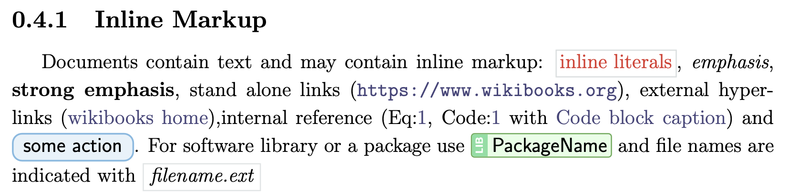
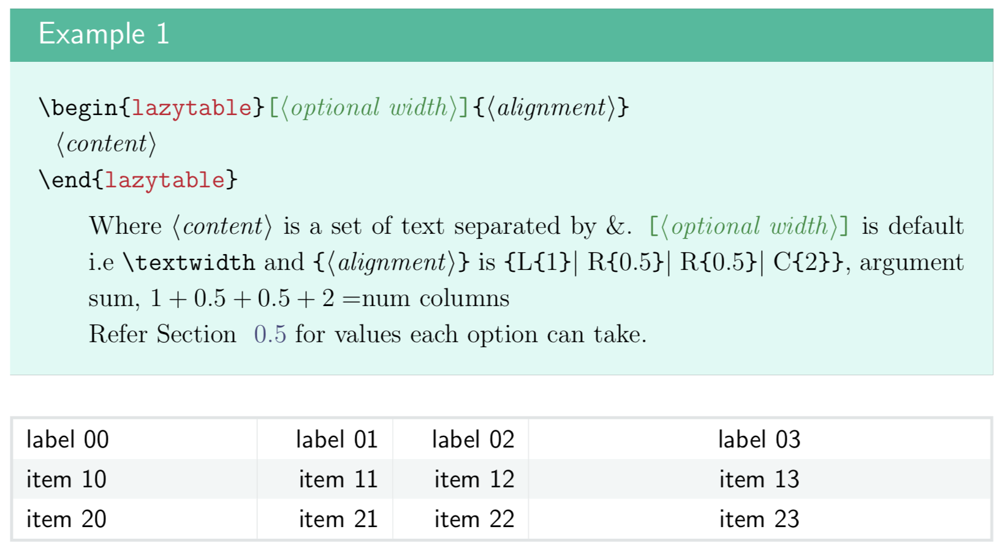

# lazylatex
Because LaTeX shouldnt be boring! :tropical_fish:
lazylatex is aLaTeX package inspired by sphinx-rtd-theme. Build with tcolorbox, minted, tikz, etc,. Some of the elements are also simulating elements from the tcolorbox manual. 
## Some Features
Please see `docs/example.pdf` for a list of all features and how to use them.
### Inline Markup

### Code Blocks

### Admonitions

### Sidebar

### Field List

### Tables

## Please fork!!
